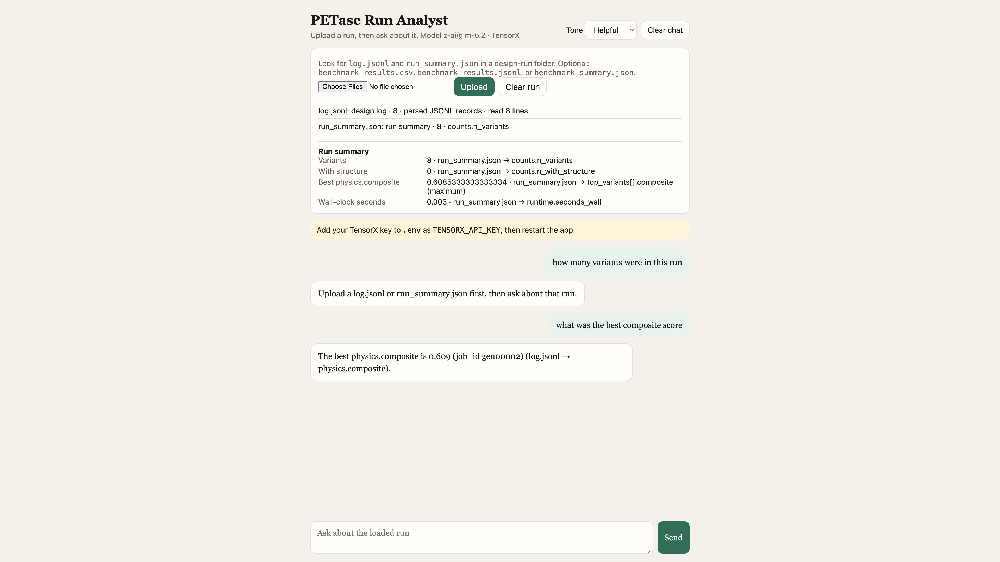

# PETase Run Analyst

Ask questions in plain English about the run logs from a protein
thermostability pipeline. **Every number is computed by the server in Python.
The language model never does the arithmetic.**

**Live app:** <https://petase-run-analyst.onrender.com>  
Public repo: <https://github.com/naterosenfeld08/demo-chat-bot>

The Render free instance sleeps after about 15 minutes idle. The first load
after that can take a minute.

## For CSCI-2521 graders

Stage 2 evidence is on GitHub. There is no separate write-up.

| What you are grading | Where it is |
|---|---|
| Problem, users, tools, timeline | [`docs/proposal.md`](docs/proposal.md) |
| User stories and acceptance criteria | [`docs/backlog.md`](docs/backlog.md) |
| Standing assistant rules | [`AGENTS.md`](AGENTS.md) |
| Feature 1 — load a run | [`specs/01-load-a-run.md`](specs/01-load-a-run.md) · [`tests/test_01_load_a_run.py`](tests/test_01_load_a_run.py) · [PR #1](https://github.com/naterosenfeld08/demo-chat-bot/pull/1) |
| Feature 2 — summary card | [`specs/02-run-summary-card.md`](specs/02-run-summary-card.md) · [`tests/test_02_run_summary_card.py`](tests/test_02_run_summary_card.py) · [PR #2](https://github.com/naterosenfeld08/demo-chat-bot/pull/2) |
| Feature 3 — ask a computed question | [`specs/03-ask-a-question.md`](specs/03-ask-a-question.md) · [`tests/test_03_ask_a_question.py`](tests/test_03_ask_a_question.py) · [PR #3](https://github.com/naterosenfeld08/demo-chat-bot/pull/3) |
| How AI was used | [`docs/dev-log.md`](docs/dev-log.md) |

This is a Flask app (`app.py` + gunicorn), not the track's FastAPI example,
because it was built on an existing Flask chat demo. The deviation is recorded
in the proposal and in `AGENTS.md` section 5.

## How it works (no code)

1. You upload a design run's `log.jsonl` and/or `run_summary.json`. The server
   identifies each file by what is *inside* it, not by the filename.
2. A summary card appears with four headline numbers. Each one names the file
   and field it came from. A written `0` stays `0`. A missing field says
   `not recorded`.
3. You type a question. The server picks which of those numbers answers it and
   writes the sentence. A stub mode (`LLM_MODE=echo`) echoes the same facts a
   live model would see, so a test can prove the number was already computed.

If the loaded run cannot answer the question, the app says so, names the
artifact that would be needed, and returns no statistic.

Caveats that stop a proxy score being read as a measured Tm are backlog item
#4 and are not shipped yet.

## Screenshot



## Try it (no API key)

Fastest: open <https://petase-run-analyst.onrender.com>, upload
`data/sample-run-seed42/log.jsonl` and `run_summary.json` from this repo
(download them from GitHub if you are not cloning), then ask `how many
variants were in this run`.

To run it on your own machine:

```bash
git clone https://github.com/naterosenfeld08/demo-chat-bot.git
cd demo-chat-bot
python3 -m venv .venv
source .venv/bin/activate          # Windows: .venv\Scripts\activate
pip install -r requirements.txt
python app.py
```

Open <http://127.0.0.1:5000>. On macOS, port 5000 is often taken by AirPlay
Receiver; if so, run `PORT=5050 python app.py` and open
<http://127.0.0.1:5050> instead.

Then:

1. Upload `data/sample-run-seed42/log.jsonl` and
   `data/sample-run-seed42/run_summary.json`.
2. The card should show **8** variants, **0** structures (ColabFold was off),
   best composite **0.6085333333333334**, and **0.003** wall-clock seconds.
3. Ask `how many variants were in this run` — answer is 8, sourced from
   `run_summary.json → counts.n_variants`.
4. Ask `what was the best composite score` — answer is **0.609** for
   `job_id gen00002`.
5. Ask `what was the GDT-TS` — the run does not record that.

A TensorX key is **not** required for any of that. The default `LLM_MODE=echo`
keeps the API key off the path.

```bash
pytest
```

All tests should pass.

## Optional: live model and Render

To have a live model *explain* the already-computed facts, copy `.env.example`
to `.env` and set `TENSORX_API_KEY`. Create a key at
[app.tensorx.ai/dashboard/keys](https://app.tensorx.ai/dashboard/keys).
That path is unused in the default echo mode.

| Render field | Value |
| --- | --- |
| Language | Python |
| Root directory | *(leave blank)* |
| Build command | `pip install -r requirements.txt` |
| Start command | `gunicorn app:app --bind 0.0.0.0:$PORT` |
| Instance type | **Free** (`plan: free` in `render.yaml`). Do not pick Starter — that is $7/month. |

No API key is required on Render if `LLM_MODE` stays `echo`. See
[docs/deploying.md](docs/deploying.md).

## Project status

**Current version:** pre-alpha (three core features shipped)
**Working:** upload a run, see the summary card, ask a few English questions
whose numbers are computed on the server.
**Not working yet:** caveats (#4), two-run compare (#5), and the later analysis
features. The app is deployed; Stage 3 still needs classmate testers. See
[docs/backlog.md](docs/backlog.md).

## How this project is organized

| Where | What's in it |
|---|---|
| [`docs/proposal.md`](docs/proposal.md) | The problem this solves and who it's for |
| [`docs/backlog.md`](docs/backlog.md) | Every feature, in build order, with its acceptance criteria |
| [`specs/`](specs/) | One page per feature: what it does, what it doesn't, what "done" means |
| [`AGENTS.md`](AGENTS.md) | The rules every AI assistant must follow in this repo |
| `app.py` | The Flask server |
| `templates/` | The HTML pages |
| `tests/` | The automatic tests |
| [`CHANGELOG.md`](CHANGELOG.md) | What changed between versions |

## License

MIT. See [LICENSE](LICENSE).
